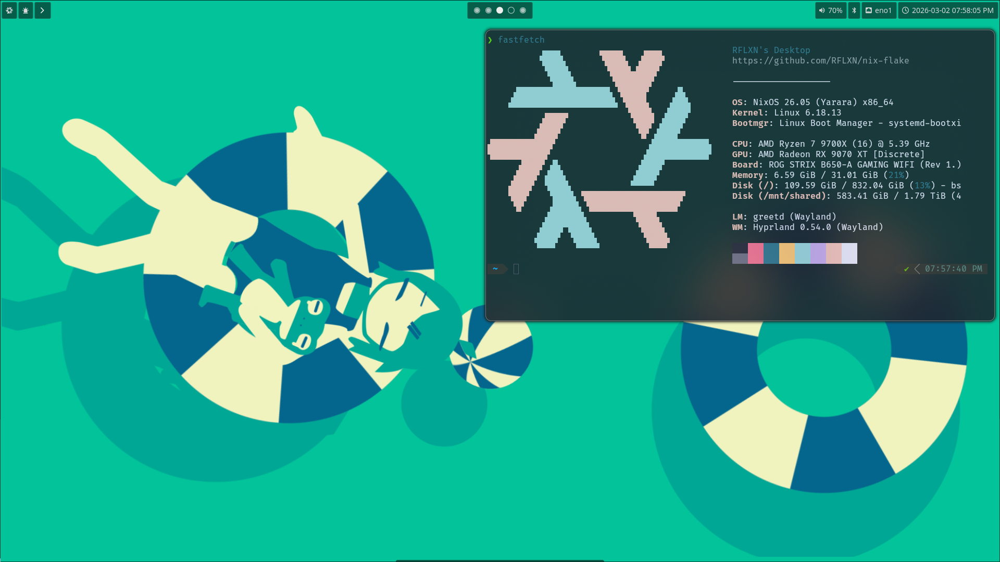
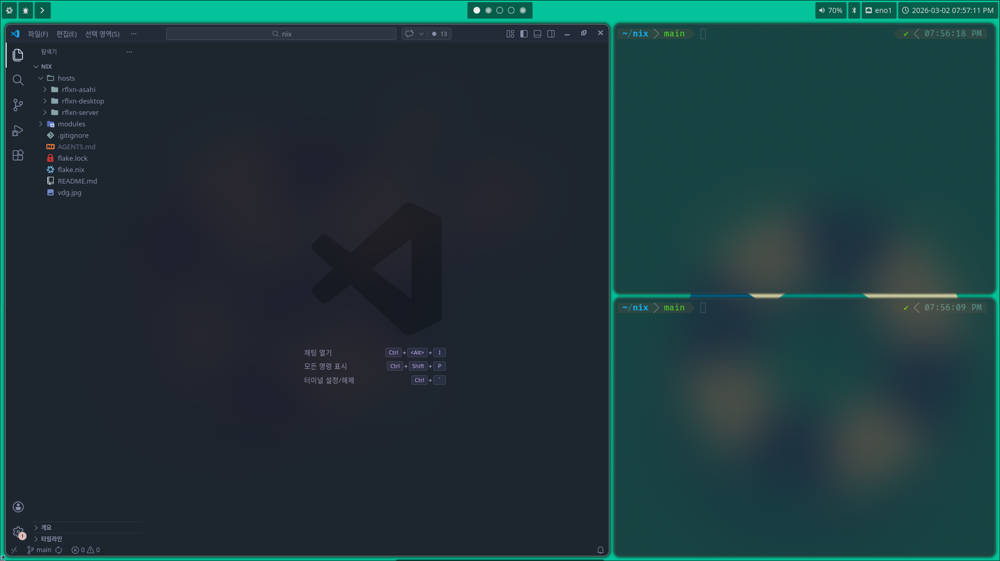

<!------------ BEGIN Header ------------>

RFLXN

The tech otaku who loves linux and web development.

<!------------ END Header ------------>

 

<!------------ BEGIN Stacks ------------>

Stacks

Languages 

DBs 

Runtimes / Libraries / Frameworks 

Publishing / DevOps 

<!------------ ENDHeader ------------>

 

 

Environments

There are 3 systems:

 
And every systems are based on NixOS. 
So, you can check 

 

 

 

Socials

